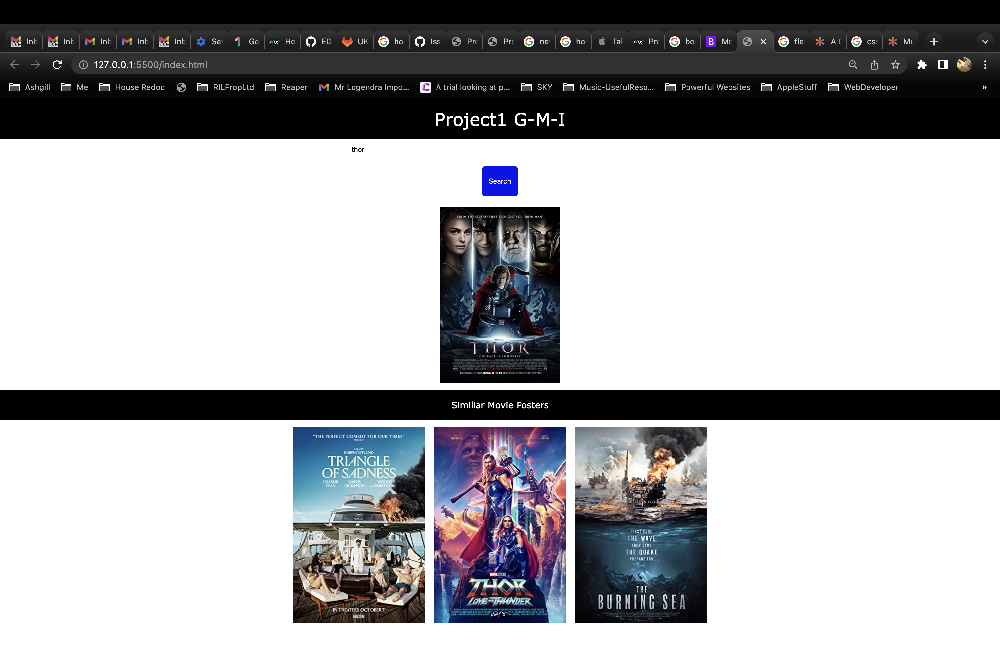

# Project1 G-M-I
## Table of contents

- [Overview](#overview)
  - [The challenge](#the-challenge)
  - [Screenshot](#screenshot)
  - [Links](#links)
- [My process](#my-process)
  - [Built with](#built-with)
  - [What I learned](#what-i-learned)
  - [Continued development](#continued-development)
  - [Useful resources](#useful-resources)
- [Author](#author)
- [Acknowledgments](#acknowledgments)

**Note: This project makes use of CORS Unblock Extension.**
Here is a link for one on Chrome: [Cors Unblock](https://chrome.google.com/webstore/detail/cors-unblock/lfhmikememgdcahcdlaciloancbhjino?hl=en) (update: not necessary as TasteDive Api ceased to work)

## Overview

The project will ask the user via a modal for a film/movie they like. From this film/movie we will display the poster of the film/movie they like using OMDBApi, then the name of 3 similar films/movies they may like from TasteDive Api and the associated posters from OMBDApi.

### The challenge

You and your group will use everything you’ve learned to create a real-world front-end application that you’ll be able to showcase to potential employers. The user story and acceptance criteria will depend on the project that you create, but your project must fulfil the following requirements:

* Use Bootstrap.

* Be deployed to GitHub Pages.

* Be interactive (i.e., accept and respond to user input).

* Use at least two [server-side APIs](https://coding-boot-camp.github.io/full-stack/apis/api-resources).

* Does not use alerts, confirms, or prompts (use modals).

* Use client-side storage to store persistent data.

* Be responsive.

* Have a polished UI.

* Have a clean repository that meets quality coding standards (file structure, naming conventions, follows best practices for class/id naming conventions, indentation, quality comments, etc.).

* Have a quality README (with unique name, description, technologies used, screenshot, and link to deployed application).


### Screenshot



### Links

- Solution URL: [https://github.com/GeorgeGio/OMDB-Api](https://github.com/GeorgeGio/OMDB-Api)
- Live Site URL: [https://georgegio.github.io/OMDB-Api/](https://georgegio.github.io/OMDB-Api/)

## Out process

We decided on our first API OMDBApi. From this we looked at what information was returned and decided how we would use that information. In this case, to the display the movie poster. We then decided that we could use TasteDive API to return movies similar to the one the user chose. But in addition to just returning those movie names we decided to return the posters for those similar movies too. 

We then set up the project and start with the Kanban wall/Todos to break the task up into manageable tasks we could all tackle separately and jointly. We worked alone and using paired programming to develop and discuss the task. Supporting each other along the way. We also communicated via Slack to ensure we all knew what was going on as we worked on parts individually. We commented out code and chose meaningful variable names to give our project good readability. We fixed any bugs as a team before moving on. We created separate branches as per the todos. And we checked/merged our code regularly. 

We decided to get the project working with a temporary basic html page before deciding on the css framework as it wasn't clear from the brief whether we should use Bootstrap or not (the readme said Use Bootstrap and rubric said we shouldn't)

We looked at tailwind but due to TasteDive going down we didn't get the time / chance to implement Tailwind. And so we had a last minute struggle to find another API and get that working. We ended up with New York Times and 3 movies but the results aren't as good as TasteDive. We used Bootstrap instead

### Built with

- Semantic HTML5 markup
- CSS custom properties
- Flexbox
- CSS Grid
- Mobile-first workflow
- Figma
- GitHub
- Bootstrap


### What we learned

- How to control the timing and sequencing of functions using .then
- How to work effectively as a team and use github to work on parts ourselves and together
- How to use more than 1 api call and to utilise that data to provide a interesting website. 
- How to utilise a both localstorage and session storage.

```js
function FetchSimilarMoviePosters() {
  for (let index = 0; index < localStorage.length; index++) {

    fetch(`https://www.omdbapi.com/?t=${localStorage[index]}&apikey=b8054373`)
      .then((response) => response.json())
      .then((data) => {
        similarMoviePosterUrl[index] = data.Poster;
      })
      .then(() => DisplaySimilarMoviePosters());
  }
}
function DisplaySimilarMoviePosters() {
  for (let index = 0; index < localStorage.length; index++) {
    let similarMoviePosterEl = document.querySelector(
      `#similar-movie-poster-${index}`
    );

    similarMoviePosterEl.src = similarMoviePosterUrl[index];
  }
}

```


### Continued development

We could check that the movie entered exists and if not, tell the user to check their entry and try again. Check if there is a poster and if not use a default image. Add movie reviews (the function is in progress.). Allow the user to click on a poster to then give the next set of results and so on. 


### Useful resources

- [TasteDive API](https://tastedive.com/read/api) - This helped us choose and use the TasteDive Api for getting similar movies to the user chosen movie.
- [OMDB API](https://www.omdbapi.com/) - The documenation here helped us utilise the movie database for our project to return the movie poster associated with the respective movie.
- [New York Time Movie Api](https://developer.nytimes.com/docs/movie-reviews-api/1/overview) - This was useful for last minute replacement of TasteDive Api. It allowed us to repurpose our project to some extent. 

## Authors

George Oustapasidis
- GitHub - [GeorgeGio](https://github.com/GeorgeGio)


Manolis Giavasis
- GitHub - [manolisgi](https://github.com/manolisgi)

Ian Logendra
- GitHub - [EDX-IL](https://github.com/EDX-IL)


## Acknowledgments

- Jonathon (TA) - helped us choose our content framework and 2 APIs. He also explained how to utilise .then for controlling the sequencing and timing of function.
- Dane and Andrew - as always. Very good instructor.s 

